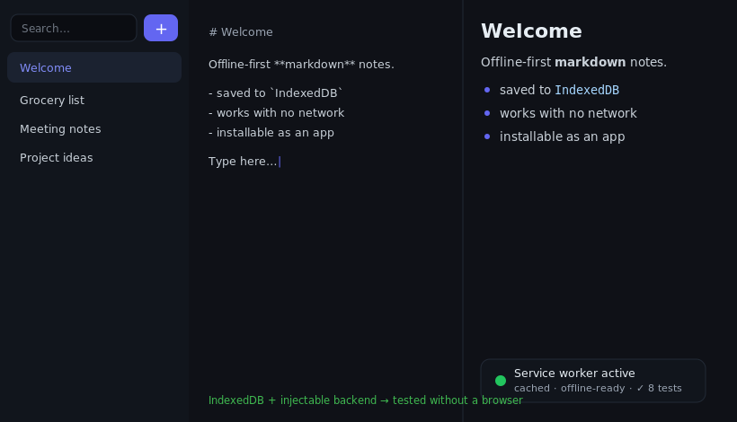

# md-notes-pwa

[](https://github.com/JCreatesGH/md-notes-pwa/actions)
[](https://web.dev/progressive-web-apps/)
[](LICENSE)

An offline-first Markdown notes app as an installable **PWA**. Notes persist in **IndexedDB**, a **service worker** makes it fully usable with no network, and a live split-pane preview renders your Markdown as you type. Zero runtime dependencies.



## Features

- 💾 **Offline-first** — IndexedDB storage + a cache-first service worker; works on a plane.
- 📲 **Installable** — web app manifest with icons; "Add to Home Screen".
- ✍️ **Live preview** — split editor/preview with a safe, escaped Markdown renderer.
- 🔎 **Search** across all notes; autosave with debounce.
- 🧪 **Tested without a browser** — storage sits behind a `KVBackend` interface, so the note logic is unit-tested with an in-memory backend.

## Run it

```bash
npm install
npm run build                 # compiles src -> dist
npx serve .                   # or any static server, then open the page
```

Open it, edit a note, then go offline (DevTools → Network → Offline) — it keeps working, and your notes are still there after a reload.

## Architecture

```
KVBackend (interface)
 ├─ IndexedDBBackend   ← browser
 └─ MemoryBackend      ← tests / fallback
NotesStore  → create / save / list / search / remove   (pure, tested)
sw.js       → cache-first offline shell
```

The dependency inversion around `KVBackend` is the key idea: the tricky persistence/search logic is covered by fast unit tests, while the real app swaps in IndexedDB.

## Development

```bash
npm install
npm test          # 8 tests (notes store + markdown)
npm run build     # tsc, clean
```

## License

MIT
